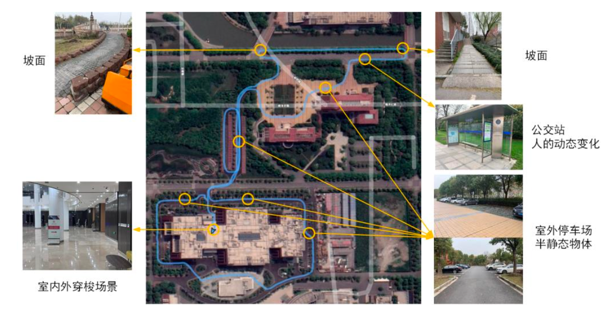
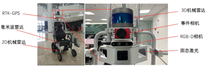

# 智能轮椅导航定位数据集

## 交龙智能轮椅数据集


## 关于数据集

交龙智能轮椅数据集以校园场景为基础，采集路线包括坡面倾斜环境、室内外穿梭环境、公交站人流环境及室外停车场半动态环境等。除了上述环境特点外，数据场景还包括白天黑夜光照变化及天气季节变化特点。单次采集路线总长约1.8km。

<p align="center">

</p>


智能轮椅数据集硬件采集平台搭载不同种类的外部传感器和内部传感器，其中外部传感器包括：RGB-D可见光相机、事件相机、2D机械激光雷达、3D机械激光雷达、固态激光雷达、毫米波雷达，内部传感器包括IMU、轮式里程计，此外，还提供了室外精度在2cm以内的RTK-GPS数据。除了2D机械激光考虑到观测视角和避障需求单独至于智能轮椅前端，其余均集成于一个传感器盒中，便于后续标定盒传感器迁移。
<p align="center">

</p>

|   传感器   |型号|性能指标
|:-------:|:-------------:|:-----------:|
| RGB-D相机 |RealSense D435i|深度传感器：分辨率1280×720，帧率90FPS，双目灰度图像
|   IMU   |embebbed|加速度计最高采样频率为250Hz，陀螺仪最高采样频率为400Hz
| 事件相机 |DAVIS346|分辨率346×260，帧率40FPS
| 3D机械激光雷达 |RS-LiDAR-16|16线机械激光雷达，最大范围150m，水平视场360°，垂直视场30°，帧率10Hz
| 3D固态激光雷达 |Livox Mid-100|最大范围260m，水平视场98.4°，垂直视场38.4°，点云速率300000点/s
| 2D机械激光雷达 |Sick TiM561|水平视场角270°，角度分辨率0.33°，扫描频率15Hz
| RTK-GPS |CGI-210|定位角度精度0.1°，定位位置精度1cm，定位数据频率100Hz

## 与主流数据集的比较


|      数据集      | ADVIO Dataset | KAIST Day/Night | Robot@Home | NCLT |Ours
|:-------------:|:-------------:|:-----------:|:----------:|:----:| :-------: |
|     发布年份      |     2018      |      2018   |    2017    | 2016 |2021-
|     长期数据集     |               |        O    |            |  O   | O
|      IMU      |       O       |        O    |            |  O   | O
| GPS (RTK-GPS) |               |        O    |            |  O   | O
|    2D机械激光     |               |            |     O      |      | O
|    3D机械激光     |               |        O    |            |  O   | O
|     单目相机      |       O       |        O    |            |  O   | O
|     双目相机      |               |            |            |  O   | O
|     全景相机      |               |            |            |  O   | 
|     深度相机      |               |            |     O      |  O   | O
|     事件相机      |               |            |            |      | O
|     固态激光      |               |            |            |      | O
|     毫米波雷达     |               |            |            |      | O


## 数据集文件结构
更多细节请参考([readme.pdf](https://robotics.sjtu.edu.cn/upload/file/dataset/dataset/sjtu_slam/readme.tar.gz))
```
ltdataset
|---- readme.pdf
|---- <sequence>
      |---- calibration
            |---- cam_intrinsic.yaml
            |---- cam_to_imu_extrinsic.yaml
            |---- imu_intrinsic.yaml
            |---- lidar_to_cam_extrinsic.yaml
      |---- ground_truth
            |---- ground_truth.txt
            |---- ...
      |---- xxx.bag
      |---- ...
|---- ...
```

## 如何下载
**我们建议使用以下链接下载本数据集**


|    采集序号     |           采集日期           | 采集时间 | 采集地点  |  采集特点  |                                                  下载链接                                                  
|:-----------:|:------------------------:|:----:|:-----:|:------:|:------------------------------------------------------------------------------------------------------:|
| Sequence 1  |        2021-08-27        |  夜晚  |  室外   |  弱光照   |   [download](https://robotics.sjtu.edu.cn/upload/file/dataset/dataset/sjtu_slam/2021-08-27-night.tar.gz)   |
| Sequence 2  |        2021-08-28        |  中午  | 室内、室外 | 室内外穿梭  |  [download](https://robotics.sjtu.edu.cn/upload/file/dataset/dataset/sjtu_slam/2021-08-28-midday.tar.gz)   |
| Sequence 3  |        2021-09-01        |  中午  | 室内、室外 | 室内外穿梭  |  [download](https://robotics.sjtu.edu.cn/upload/file/dataset/dataset/sjtu_slam/2021-09-01-midday.tar.gz)   |
| Sequence 4  |        2021-10-09        |  中午  |  室外   |  高人流   |  [download](https://robotics.sjtu.edu.cn/upload/file/dataset/dataset/sjtu_slam/2021-10-09-midday.tar.gz)   |
| Sequence 5  |        2021-10-10        |  夜晚  | 室内、室外 |  弱光照   |   [download](https://robotics.sjtu.edu.cn/upload/file/dataset/dataset/sjtu_slam/2021-10-10-night.tar.gz)   |
| Sequence 6  |        2021-11-13        |  下午  |  室外   | 坡面倾斜场景 | [download](https://robotics.sjtu.edu.cn/upload/file/dataset/dataset/sjtu_slam/2021-11-13-afternoon.tar.gz) |
| Sequence 7  |        2021-11-26        |  中午  |  室外   | 坡面倾斜场景 |  [download](https://robotics.sjtu.edu.cn/upload/file/dataset/dataset/sjtu_slam/2021-11-26-midday.tar.gz)   |
| Sequence 8  |        2021-12-02        |  黄昏  |  室外   |  光照变化  |   [download](https://robotics.sjtu.edu.cn/upload/file/dataset/dataset/sjtu_slam/2021-12-02-dusk.tar.gz)    |
| Sequence 9  |        2021-12-09        |  中午  |  室外   | 小雨潮湿地面 |      [download](https://robotics.sjtu.edu.cn/upload/file/dataset/dataset/sjtu_slam/2021-12-09.tar.gz)      |
| Sequence 10 |        2021-12-13        |  夜晚  |  室外   |  弱光照   |   [download](https://robotics.sjtu.edu.cn/upload/file/dataset/dataset/sjtu_slam/2021-12-13-dusk.tar.gz)    |
|   所有(推荐）    | 2021-08-27 -- 2021-12-13 | 全天候  | 室内、室外 |  挑战场景  |         [download](https://robotics.sjtu.edu.cn/upload/file/dataset/dataset/sjtu_slam/all.tar.gz)          |


**交大云下载链接（支持上海交通大学内网访问）**

```
交大云 https://jbox.sjtu.edu.cn/l/R1eeEG
```

**百度云下载链接（尚未完成）**

```
百度云 尚未完成
```

**Google Drive 下载链接（尚未完成）**

```
Google Drive link： 尚未完成
```